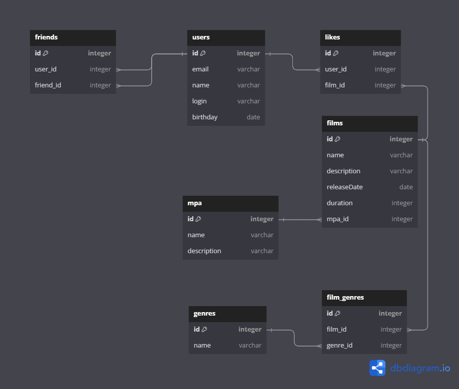

# java-filmorate

Фильмов много — и с каждым годом становится всё больше.
Чем их больше, тем больше разных оценок.
Чем больше оценок, тем сложнее сделать выбор. Однако не время сдаваться!
Filmorate это сервис, который работает с фильмами и оценками пользователей,
а также возвращает топ-5 фильмов, рекомендованных к просмотру.
Теперь ни вам, ни вашим друзьям не придётся долго размышлять,
что посмотреть вечером.

## Схема дазы данных



### Таблица friends

* Служит для хранения связи «дружба» между двумя пользователями
* Неподтверждённая — когда один пользователь отправил запрос на добавление другого пользователя в друзья,
* Подтверждённая — когда второй пользователь согласился на добавление.

### Таблица users

* Служит для хранения пользователей

### Таблица likes

* Служит для хранения лайков на понравившиеся пользователям фильмы

### Таблица films

* Служит для хранения информации о фильмах

### Таблица film_genres

* Служит для хранения информации о жанрах, к которым принадлежит фильм

### Таблица genres

* Служит для хранения жанров

### Таблица mpa

* Служит для хранения информации рейтинге Ассоциации кинокомпаний
  (англ. Motion Picture Association, сокращённо МРА).
  Эта оценка определяет возрастное ограничение для фильма.
  Значения могут быть следующими:
    - G — у фильма нет возрастных ограничений,
    - PG — детям рекомендуется смотреть фильм с родителями,
    - PG-13 — детям до 13 лет просмотр не желателен,
    - R — лицам до 17 лет просматривать фильм можно только в присутствии взрослого,
    - NC-17 — лицам до 18 лет просмотр запрещён.

### Примеры запросов

* Получить пользователя по id:

```SQL
SELECT 
  name
  email
  login
  birsday
FROM users
WHERE id = 123
```